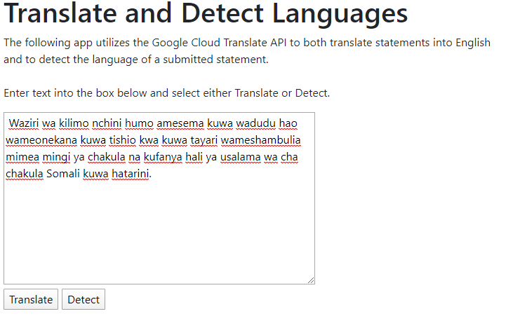
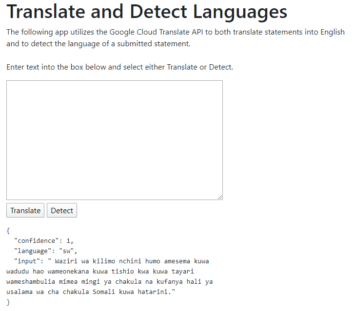
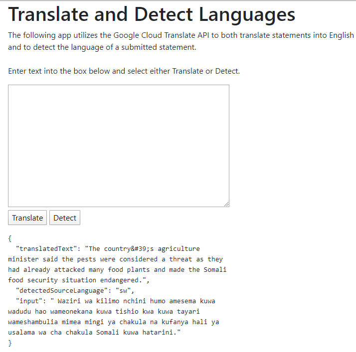

# DSBA-6190 Project 1 - Continuous Delivery of Flask Application on GCP
The goal of this project is to create a Flask App on the Google Cloud Platform enabled with continuous delivery. For the flask app, 
I decided to also integrate a Google Cloud API in order to become more familiar with using the avaialble APIs and ensuring the APIs 
successfull operate. The API I used was Google Cloud Translate, and with this API I developed an app with two functions: Detect and 
Translate. Furthermore, this project was connected with CircleCI to also ensure contiuous integration and testing. 

The deployed app can be found at following url:

https://dsba-6190-proj1.appspot.com

The screenshots used in this README show how to use the app. The example input text comes from a BBC news article in Swahili. (https://www.bbc.com/swahili/habari-51348315) 

## Input Text
The following screenshot shows the text input into the app. 

## Detect
The detect function takes a provdied text and detects the language of the text as a whole. It then provides a condfidcence value
indicating the level of confidence in said detection. 

## Translate
The translate function takes provided text and translates the text into English. It automatically detects the source langue 
of the proivided text.

Future versions of this app would allow the user to select the output text language, as opposed ot defaulting to english.

